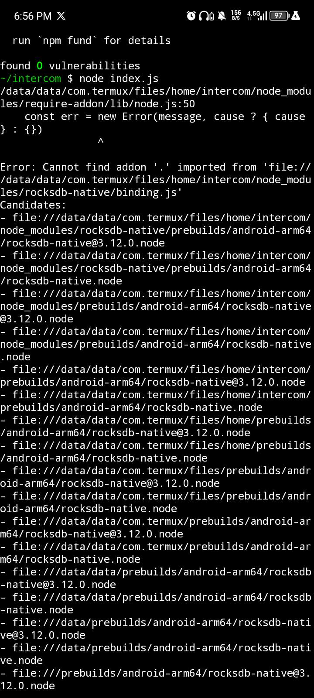
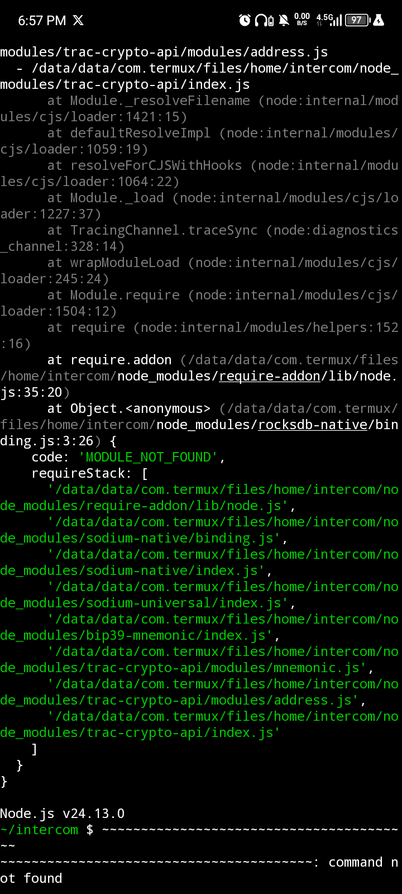
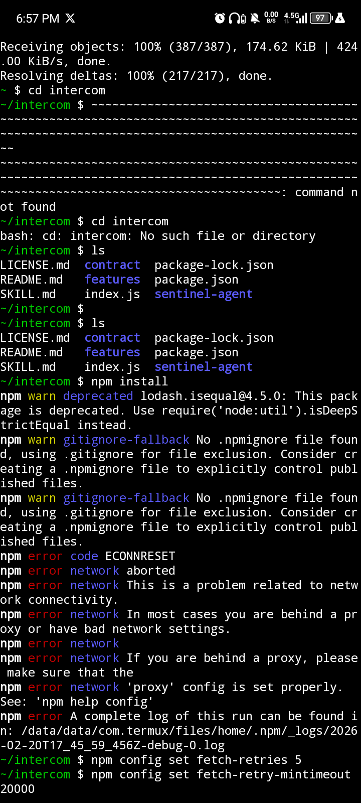

# Intercom Sentinel

Peer Liveness & Health Monitor for the Trac Intercom Agent Mesh.


## Overview

Intercom Sentinel is a native runtime feature built directly into the Intercom stack.

It monitors real peer activity on the network by observing sidechannel message flow and tracking last-seen timestamps for connected peers.

Inactive peers are automatically flagged as DEAD after a configurable timeout.


## Why This Matters

Distributed agent networks require visibility into liveness.

Without peer health monitoring:

- Stale peers degrade reliability
- Network health is opaque
- Operators lack runtime awareness

Sentinel introduces lightweight infrastructure-level observability to the Intercom protocol.


## How It Works

- Hooks into real sidechannel message flow
- Updates heartbeat on peer activity
- Performs periodic liveness checks
- Prints real-time health status to terminal


No external dependencies.
Fully integrated into runtime.


# Trac Address 💰

trac1vfv5q5alf7xcs406vmm5c0k5xe3t23c9asx8ykumq63zp4pes5jsxcdz4f


## Feature Integration

Sentinel is registered as a protocol feature:

```js
const sentinel = new Sentinel(peer, { timeout: 60000 });
await peer.protocol.instance.addFeature('sentinel', sentinel);
sentinel.start();


## Proof of Execution

Tested in Android (Termux ARM64).

Dependencies installed successfully.

Runtime initializes and reaches native RocksDB binding stage.

Screenshots:






